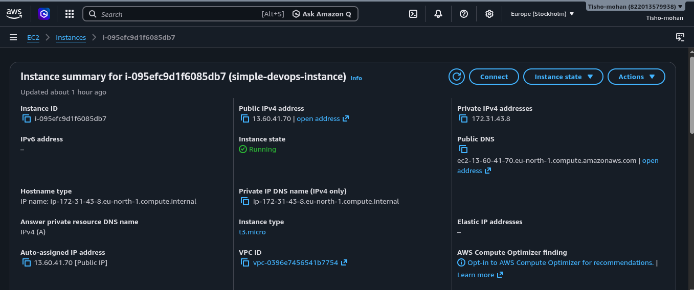
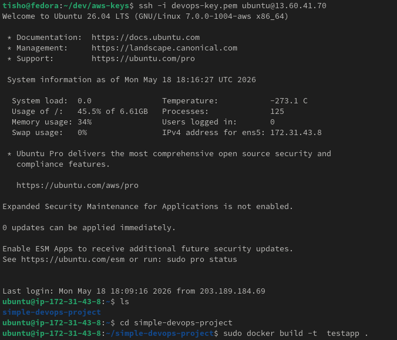
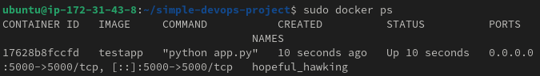
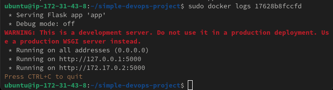
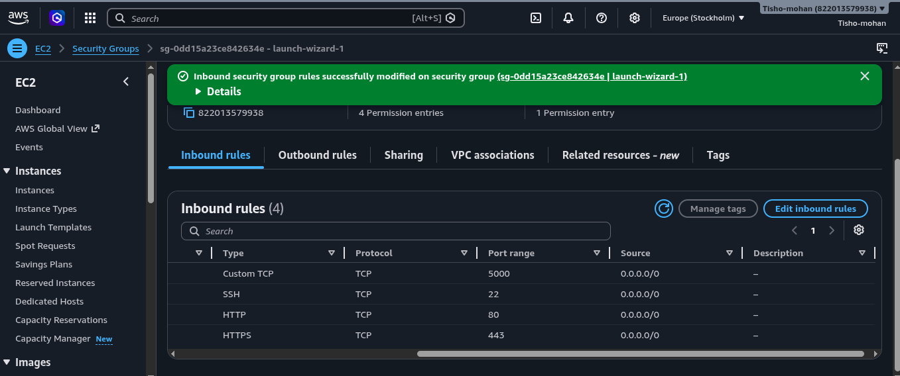
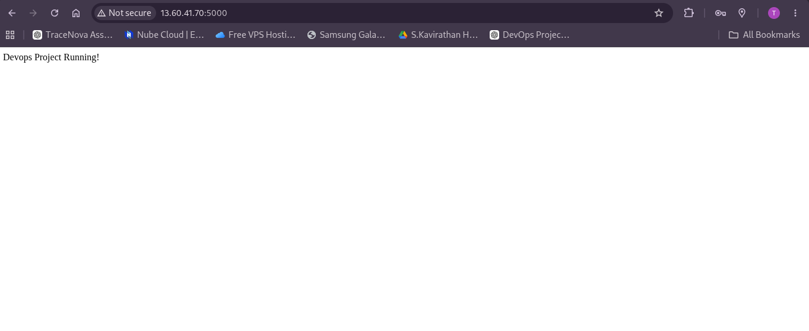

# 🚀 Simple DevOps Project - Dockerized Flask App on AWS EC2

## 📌 Overview
This is my DevOps learning project where I built a simple Python Flask application and deployed it on an AWS EC2 instance using Docker.

The goal of this project is to understand a real-world DevOps workflow:

- Writing application code (Flask)
- Using Docker for containerization
- Deploying on AWS EC2
- Using SSH for remote server management
- Exposing application to the internet
- Using Git & GitHub for version control

---

## 🛠 Tech Stack
- Python (Flask)
- Docker
- AWS EC2
- Linux (Fedora / Ubuntu)
- Git & GitHub

---

## 📁 Project Structure

Simple-Devops-Project/
├── app.py
├── Dockerfile
├── requirements.txt
├── README.md
└── images/
├── aws-instance-created.png
├── ssh-into-instance.png
├── docker-ps.png
├── docker-logs.png
├── security-group-ports.png
└── website-public-access.png


---

## ⚙️ How It Works
- Flask app runs a simple web server
- Docker builds the application into a container image
- Container runs on EC2 instance
- AWS Security Group allows external access via port 5000
- Application is accessible via public IP

---

## 🚀 Deployment Steps (AWS + Docker)

### 1. AWS EC2 Instance Created


---

### 2. SSH Into EC2 Instance


---

### 3. Running Docker Container


---

### 4. Docker Logs


---

## 🌐 Network & Public Access Setup

### Security Group Configuration (Inbound Rules)


Allowed ports:
- 22 → SSH access
- 5000 → Flask application

---

### Application Access via Internet


Access URL:

http://13.60.41.70:5000/


---

## 📡 How to Run Locally

### 1. Clone Repository
```bash
git clone https://github.com/Tisho-mohan/simple-devops-project.git
cd simple-devops-project
2. Build Docker Image
docker build -t myapp .
3. Run Docker Container
docker run -d -p 5000:5000 myapp
4. Open in Browser
http://localhost:5000

OR AWS deployment:

http://13.60.41.70:5000/
🎯 Learning Outcomes
Learned Docker containerization
Understood AWS EC2 deployment
Practiced SSH remote server access
Learned security groups & networking basics
Understood full DevOps lifecycle

📌 Future Improvements
Add CI/CD pipeline using GitHub Actions
Automate deployment to EC2
Add Nginx reverse proxy
Add monitoring (Prometheus + Grafana)
Deploy using Docker Compos